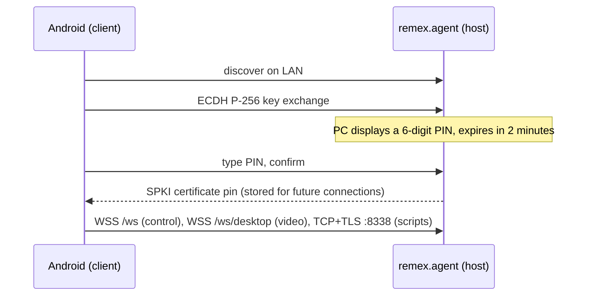
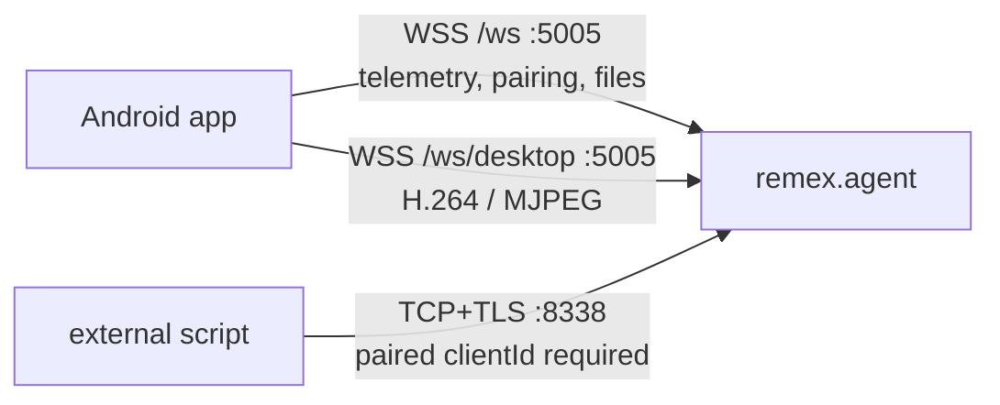

<div align="center">


# RemEx

remote control for your PC, from your phone

[](https://github.com/clindsay94/RemEx/releases)
[](https://github.com/clindsay94/RemEx/actions/workflows/dotnet.yml)
[](https://github.com/clindsay94/RemEx/releases)
[](https://github.com/clindsay94/RemEx/commits/main)
[](LICENSE)
[](https://play.google.com/store/apps/details?id=com.clindsay94.remex)

</div>

```text
+--------------------------------------------------------------+
| >R_  remex.agent                                      - [] x |
+--------------------------------------------------------------+
|                                                              |
|  ____                _____                                   |
| |  _ \ ___ _ __ ___ | ____|_  __                             |
| | |_) / _ \ '_ ` _ \|  _| \ \/ /                             |
| |  _ <  __/ | | | | | |___ >  <                              |
| |_| \_\___|_| |_| |_|_____/_/\_\                             |
|                                                              |
| your PC, from your phone. one LAN, no relay, no account.     |
|                                                              |
| > host      Windows or Linux                                 |
| > client    Android 14 or newer                              |
| > channels  wss :5005   tcp+tls :8338                        |
| > relay     none                                             |
| >R_                                                          |
|                                                              |
+--------------------------------------------------------------+
```

I built RemEx because I wanted to run my PC from my phone over plain LAN, no
relay server, no account, no subscription. It's an Android app plus a
Windows/Linux agent: screen streaming, remote input, file transfer, clipboard
sync, wake-on-LAN, power control. Just the two devices, talking directly.

Current release: **2.5.0** (2026-09-10), 1,129 commits and 1,030 files
changed since 2.4.0. See [What's new in 2.5.0](#whats-new-in-250) below, or
the [full release notes](docs/RELEASE-NOTES-2.5.0.md).

## Where it's rough

I'd rather say this up front than have you find it:

- No audio. Screen and input only, nothing carries sound.
- Android 14 or newer only (`minSdk` 34); there's no support path below that.
- Windows and Linux hosts, Android is the only client. No macOS host, no iOS.
- Same LAN, unless you run Tailscale (see below) to reach the PC remotely.
- The Linux host backend is newer and thinner than the Windows one. 2.5.0
  landed several input and capture fixes for it, but I'd still call Windows
  the more exercised path.
- The Play build is open testing, not a finished release. If something's
  rough, that's expected, and I'd rather hear about it than have you assume
  it's just how it is.

## Get started in five minutes

1. **Install the Android app.** RemEx is in Open Testing on Google Play:
   https://play.google.com/store/apps/details?id=com.clindsay94.remex
   (package `com.clindsay94.remex`). On the store page, join the "Join the
   beta" testing program first if the app isn't installable yet; after that
   it installs and updates like any other Play app. Sideload instead from
   [GitHub Releases](https://github.com/clindsay94/RemEx/releases) if you'd
   rather not join the testing track, see
   [sideloading on Samsung](#sideloading-on-android-samsung-notes) below.
2. **Install the PC agent.**
   - Windows: download `RemEx-v2.5.0-Setup.exe` from
     [Releases](https://github.com/clindsay94/RemEx/releases) and run it.
     remex.agent runs as an always-elevated process (it needs that for input
     injection and power control).
   - Linux: download `remex-agent-v2.5.0-linux-x64.tar.gz`, see
     [Linux install](docs/LINUX_INSTALL.md).
3. **Pair.** Open the agent on the PC, open RemEx on the phone, same
   Wi-Fi/LAN. The PC shows a 6-digit PIN (expires in 2 minutes), you type it
   into the phone, done. No account, nothing leaves the LAN. Full walkthrough,
   including the first-run tutorial and PC readiness check, in
   [docs/INSTALL-ANDROID.md](docs/INSTALL-ANDROID.md#first-pairing).



## What's new in 2.5.0

```text
[2.5.0] boot log
  * theming    : palette engine replaces 4 fixed presets (seed+style+mode+contrast)
  * theming    : Palette Studio - color wheel, "from this PC", live preview
  * theming    : "match my phone" pushes phone theme to PC on connect
  * security   : 6 findings closed (audit below)
  * desktop    : cert pinning on the remote-desktop channel now actually enforced
  * transfer   : speed+ETA, whole-folder transfer, collision prompts
  * control    : fixed keys-stuck-down on disconnect; clipboard push; WoL without typing a MAC
  * ci         : first CI this repo has ever had (build+test, localization check)
  * total      : 373 fixes, 1129 commits, 1030 files
```

> [!IMPORTANT]
> 2.5.0 closed a security audit with 6 findings, including an unauthenticated
> `/debug/logs` endpoint that leaked the live pairing PIN and client IDs, and
> a TLS cert-pinning path that silently accepted any certificate when no pin
> was configured. If you're running an older build, update. Details in
> [docs/RELEASE-NOTES-2.5.0.md](docs/RELEASE-NOTES-2.5.0.md) and
> [docs/SECURITY_EXPLAINED.md](docs/SECURITY_EXPLAINED.md).

The bullet-by-bullet record, 770 entries with bead IDs, is in [docs/CHANGELOG.md](docs/CHANGELOG.md).

<details>
<summary>Full feature list</summary>

- Remote desktop screen streaming (H.264, on-demand IDR keyframe requests, configurable/rate-limited fps)
- Remote input, including stylus
- File transfer: whole-folder, name-collision handling (Replace/Keep both/Skip, apply-to-all), speed and ETA
- App launcher (`LaunchApp`), now allowlisted, no arbitrary or network/UNC paths
- Power controls (shutdown, reboot, etc.) and Wake-on-LAN (no more typing the MAC address)
- Clipboard sync, phone to PC
- Multi-monitor support (including monitors placed above/left of the origin, fixed on Linux in 2.5.0)
- Palette Studio and seed-based theming (PC), Material You dynamic color as a real toggle (Android)
- Paired-device management: rename/unpair from Settings, tap-to-connect from the phone
- First-run tutorial (Android) and paged tutorial carousel (PC), plus the Home-screen readiness check (admin rights, certificate, firewall, start-at-sign-in)
- Localized in 9 languages: en, es, fr, hi, id, pl, pt-BR, tr, uk

</details>

## Sideloading on Android (Samsung notes)

If you install the APK from [GitHub Releases](https://github.com/clindsay94/RemEx/releases)
instead of Google Play:

- Android will prompt to allow installs from this source once ("unknown
  sources"), normal Android behavior for any APK not installed via Play.
- Samsung phones additionally ship **Auto Blocker**, which can block sideloaded
  app installs by default. If the install is silently refused, check
  Settings -> Security and privacy -> Auto Blocker and allow the install (or
  temporarily disable Auto Blocker for the install).
- The app is published by a verified Google Play developer account either way.

See [docs/INSTALL-ANDROID.md](docs/INSTALL-ANDROID.md) for the full walkthrough
(Play open testing enrollment, sideload steps, Auto Blocker, first pairing).

## How it talks to your PC



| Channel | Port | Carries |
|---|---|---|
| `WSS /ws` | 5005 | telemetry, power control, pairing, file transfer |
| `WSS /ws/desktop` | 5005 | remote desktop video (H.264/MJPEG) |
| `TCP+TLS` | 8338 | external script ingress, requires a paired client ID |

Pairing is ECDH P-256 key exchange plus a 6-digit PIN shown on the PC and
typed on the phone, then SPKI certificate pinning for every connection after
that, over TLS 1.3 (1.2 accepted). There's no cloud relay, no account, and no
telemetry leaves the local network. See
[docs/SECURITY_EXPLAINED.md](docs/SECURITY_EXPLAINED.md) for how it works and
[docs/SECURITY.md](docs/SECURITY.md) for the reporting policy. To reach your
PC when you're not on the same network, run [Tailscale](https://tailscale.com)
on both ends. RemEx itself has no relay of its own.

## Windows host

Download `RemEx-v2.5.0-Setup.exe` from
[Releases](https://github.com/clindsay94/RemEx/releases) and run the
installer (Inno Setup). The agent installs itself to always run elevated,
it needs that for input injection, power control, and the firewall rule it
sets up. Uninstall from Windows Settings > Apps like any other program.

## Linux host

Download `remex-agent-v2.5.0-linux-x64.tar.gz` from
[Releases](https://github.com/clindsay94/RemEx/releases). Full setup,
dependencies, and the native capture/input backend (built with CMake/C++,
`ydotool`-based) are covered in [docs/LINUX_INSTALL.md](docs/LINUX_INSTALL.md),
which documents Arch/CachyOS/Manjaro, Ubuntu/Debian/Pop!_OS, and Fedora
package names.

## Building from source

```powershell
git clone https://github.com/clindsay94/RemEx.git
cd RemEx
./build-remex.ps1 -Target all -Config release   # PC + Android, one command
./scripts/verify.ps1                             # clean build + .NET test suite, writes a receipt
./scripts/verify.ps1 -Scope all                  # plus Android release tests and lintRelease
./scripts/verify.ps1 -Check                      # does the last receipt still match the code on disk?
```

<details>
<summary>Toolchain versions and project layout</summary>

- .NET SDK 10.0.x, Avalonia 12.1.1 (`remex.desktop`)
- Kotlin 2.3.21, AGP 9.2.1, Gradle 9.4.1, JDK 17, Compose UI 1.12.0-beta02 with Material3 1.5.0-alpha24 (`remex.android`)
- `remex.core`, shared protocol/models (`RemexMessage`, `DesktopMeta`, `TelemetryPayload`), targets `net10.0` and `net10.0-android`
- `remex.agent` / `remex.agent.windows` / `remex.agent.native.linux`, the PC host and its platform backends
- `remex.desktop`, Avalonia UI (Palette Studio, dashboard, tray)
- `remex.android`, the Kotlin/Compose client
- `remex.branding`, shared branding assets
- `installer/`, Inno Setup (`RemEx.iss`) for Windows, packaging scripts for Linux
- `*.tests` projects per component, plus `remex.desktop.render.tests` for UI screenshot/automation checks

Full build docs: [docs/BUILDING.md](docs/BUILDING.md). CI runs on GitHub
Actions: `.github/workflows/dotnet.yml` builds and tests Windows + Linux on
every PR to main; `.github/workflows/localization-check.yml` checks all 9
languages for missing, stale, unused, or format-mismatched keys.

</details>

<details>
<summary>What's next (no promises)</summary>

The only thing I'm actually tracking toward is bead `RemEx-8wpvr`: a sensor
alerts center (a configured-alert bell, latched trip state until you
acknowledge it, an alerts settings card, and a tray notification). Everything
past that is backlog, not a roadmap. If you want to see what's open, `bd
ready` in the repo shows it.

</details>

## Contributing

See [docs/CONTRIBUTING.md](docs/CONTRIBUTING.md) and
[docs/CODE_OF_CONDUCT.md](docs/CODE_OF_CONDUCT.md). This repo is developed
with Claude Code; [AGENTS.md](AGENTS.md) has the project rules (architecture
invariants, the verification gate, coding conventions) if you're pairing an
agent with it.

> [!WARNING]
> Read [docs/REGRESSION-GUARDS.md](docs/REGRESSION-GUARDS.md) before touching
> capture, the remote-desktop stream/pacing, the Android H.264 decoder,
> SurfaceView zoom/pan, pairing/trust, or the session guard. Every rule in
> there exists because breaking it reintroduced a real failure that showed up
> as silence, a black screen, a dead stream, a bricked pairing, with no log
> line pointing back at the cause.

## Reporting a security issue

Please don't open a public issue for a vulnerability. See
[docs/SECURITY.md](docs/SECURITY.md) for how to report privately.

## Docs index

| Doc | What's in it |
|---|---|
| [docs/RELEASE-NOTES-2.5.0.md](docs/RELEASE-NOTES-2.5.0.md) | Readable summary of everything in 2.5.0 |
| [docs/CHANGELOG.md](docs/CHANGELOG.md) | Full changelog, all versions |
| [docs/INSTALL-ANDROID.md](docs/INSTALL-ANDROID.md) | Play open testing, sideloading, Auto Blocker, first pairing |
| [docs/ANDROID_SETUP.md](docs/ANDROID_SETUP.md) | Android dev environment / SDK setup |
| [docs/LINUX_INSTALL.md](docs/LINUX_INSTALL.md) | Linux agent install and dependencies |
| [docs/BUILDING.md](docs/BUILDING.md) | Full build instructions, all platforms |
| [docs/ARCHITECTURE-HOST.md](docs/ARCHITECTURE-HOST.md) | PC agent architecture |
| [docs/API_CONTRACTS.md](docs/API_CONTRACTS.md) | Message/protocol contracts between client and host |
| [docs/FILE_SHARING.md](docs/FILE_SHARING.md) | File transfer design |
| [docs/SECURITY.md](docs/SECURITY.md) | Vulnerability reporting policy |
| [docs/SECURITY_EXPLAINED.md](docs/SECURITY_EXPLAINED.md) | How pairing, pinning, and the channels work |
| [docs/CONTRIBUTING.md](docs/CONTRIBUTING.md) | How to contribute |
| [docs/CODE_OF_CONDUCT.md](docs/CODE_OF_CONDUCT.md) | Code of conduct |
| [docs/REGRESSION-GUARDS.md](docs/REGRESSION-GUARDS.md) | Guards against known silent-failure regressions |
| [docs/FAQ-PARITY.md](docs/FAQ-PARITY.md) | Developer doc: the 16 FAQ questions both apps must answer, and the parity rule |
| [docs/ASYNC_GUIDELINES.md](docs/ASYNC_GUIDELINES.md) | Async coding conventions |
| [docs/NULL_SAFETY_GUIDELINES.md](docs/NULL_SAFETY_GUIDELINES.md) | Null-safety conventions |
| [docs/VALIDATION_GUIDELINES.md](docs/VALIDATION_GUIDELINES.md) | Input validation conventions |
| [AGENTS.md](AGENTS.md) | Project rules for coding agents |

Older plans, specs, audits and measurements are kept out of the repo on purpose
(`docs/old-docs/`, `docs/plans/` and `docs/superpowers/` are gitignored).

## License

MIT. See [LICENSE](LICENSE).
