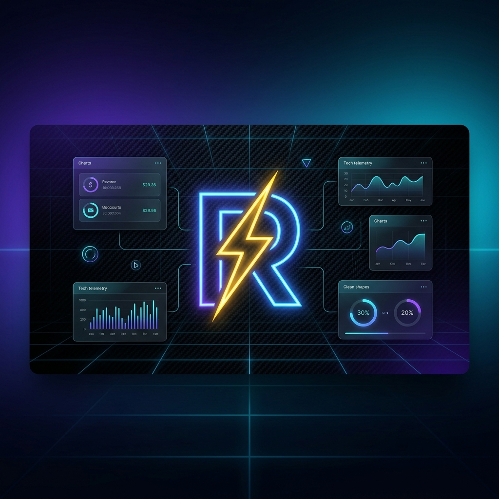
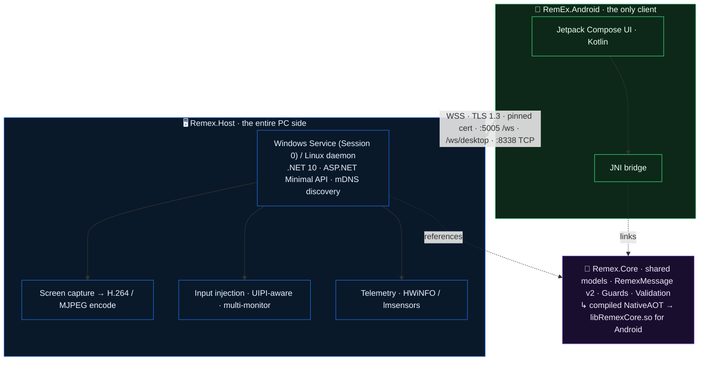

<div align="center">



# RemEx — Remote Execution

### Your PC, in your pocket. A buttery‑smooth, end‑to‑end‑encrypted remote desktop and control suite that turns any Android phone into a full remote for your Windows or Linux machine.

<p>
  
  
  
  
</p>

<p>
  
  
  
  
  
  
  
</p>

<sub>**Android (client) → PC (host).** One encrypted connection. No cloud relay, no account, no telemetry leaving your network.</sub>

</div>

---

## ✨ Why RemEx

Most remote tools make you choose: smooth *or* secure, simple *or* powerful, Windows *or* Linux. RemEx refuses the trade‑off.

It streams your desktop at up to **120 FPS** with a hardware‑accelerated H.264 pipeline, injects pixel‑perfect touch, stylus, and keyboard input — even into elevated admin windows — and does it all over a **TLS 1.3** channel locked to *your* device with cryptographic pairing and certificate pinning. The host runs as a hardened background service on Windows **and** Linux; the client is a gorgeous, glassmorphic Android app that speaks eight languages and adapts to your phone live.

> **Architecture in one line:** the PC runs `Remex.Host` (the entire PC side — service + dashboard UI), and your Android phone is the one and only client. The connection is always direct, non‑loopback, and encrypted.

---

## 🧭 Table of Contents

- [What's New in 2.0](#-whats-new-in-20)
- [Feature Tour](#-feature-tour)
- [Architecture](#-architecture)
- [Communication Protocols](#-communication-protocols)
- [Security Model](#-security-model)
- [Getting Started](#-getting-started)
- [Building from Source](#-building-from-source)
- [Experience & Personalization](#-experience--personalization)
- [Documentation](#-documentation)
- [Project Layout](#-project-layout)
- [Roadmap](#-roadmap)
- [Contributing](#-contributing)
- [License](#-license)

---

## 🚀 What's New in 2.0

RemEx 2.0 is a ground‑up overhaul of the streaming and input pipeline. The headline: it finally *feels* like you're sitting at the machine.

| 🎬 Remote Desktop | ⚡ Performance | 🔒 Security |
|---|---|---|
| Native **H.264** hardware pipeline (NVENC / QSV / AMF / VAAPI / x264) with automatic **MJPEG** fallback | **120 FPS** default streaming with a hybrid precision frame‑pacer | End‑to‑end **TLS 1.3 / WSS** on every byte |
| **True native cursor** streamed as a live bitmap and drawn at the real hotspot | **Spring‑smoothed** cursor motion (60 Hz position stream, critically‑damped client interpolation) | **ECDH P‑256 + 6‑digit PIN** pairing — no plaintext keys, ever |
| **Zoom pan‑follow** — the view glides to keep the cursor on screen | **Sub‑millisecond** Annex‑B frame slicing via AUD markers | **SHA‑256 SPKI certificate pinning** — unknown certs fail closed |

### Refinements that landed in the 2.0 line

- **120 FPS, honestly.** A naïve `Task.Delay` rounds up to the OS timer (~15.6 ms on Windows) and silently caps you near 60 FPS. RemEx now coarse‑sleeps for the bulk of each frame and **busy‑spins the final few milliseconds** with `Thread.SpinWait` — no global timer hacks — so high‑refresh phones get the real frame rate on Windows *and* Linux.
- **Cursor that glides, not steps.** The host streams cursor position at ~60 Hz; the client animates the overlay toward each point with a **critically‑damped spring**, snapping cleanly on (re)appearance or display switch. The real Windows cursor *shape* is streamed as a BGRA bitmap, so you see the actual I‑beam, resize, and hand cursors — moving smoothly even over a static desktop.
- **Cursor confinement.** While streaming a single monitor, the host pins the pointer to that display with `ClipCursor` (re‑applied every tick) so it can't wander onto a screen you can't see. Released the instant streaming stops.
- **Rotation freedom + letterboxing.** The remote screen rotates with your device instead of being forced landscape, and H.264 video **letterboxes to preserve aspect ratio** — a landscape desktop viewed in portrait looks correct instead of squished.
- **Input that actually lands.** Control now works against **elevated (admin) windows** — the interactive host launches with the user's *linked full‑admin token* (HIGH integrity) so Windows UIPI no longer drops your taps. Stylus/S‑Pen taps on the exact **(0,0) hot corner** are no longer dropped, phantom corner‑clicks are gone, and **secondary monitors** (including those at negative virtual‑desktop origins) map correctly.
- **Type anything.** Emoji and other non‑BMP characters now type through correctly — surrogate pairs are emitted as a single batched key event group instead of being broken apart.
- **Keep‑session‑unlocked (opt‑in, Windows).** A security‑sensitive, *off‑by‑default* mode that keeps your signed‑in session usable for the life of a connection — reconnecting a locked/disconnected session to the console so input keeps working even after a Microsoft "Windows App" RDP client disconnects. Every unlock/re‑lock is audit‑logged.

<sub>Full details in [`docs/CHANGELOG.md`](docs/CHANGELOG.md) and [`docs/release-notes-2.0.md`](docs/release-notes-2.0.md).</sub>

---

## 🧰 Feature Tour

### 🎥 Remote Desktop
- Hardware‑accelerated **H.264** streaming with a hardware‑decoded zero‑copy `TextureView`/`Surface` path on Android, and graceful **MJPEG** degradation when no encoder is available.
- Producer/consumer decoupling with a non‑blocking latest‑frame buffer — capture never blocks the wire and you always see the freshest frame.
- Per‑display streaming, cursor confinement, zoom with pan‑follow, and aspect‑correct letterboxing.

### 🖱️ Control & Input
- Absolute and relative pointer modes, drag, long‑press right‑click, scroll.
- **Stylus / S‑Pen** support with hover, pressure‑aware contact, and accurate edge/corner mapping.
- Full keyboard with Unicode (including emoji) and a special‑keys toolbar.
- Multi‑monitor aware across primary and secondary displays.

### 📊 Live Telemetry
- Real‑time hardware sensors via **HWiNFO** (Windows) and **lmsensors** (Linux).
- A free‑form **4,000 × 4,000 canvas** to arrange sensor cards exactly how you like, with snapshot‑to‑clipboard.

### ⚡ Power & Quick Actions
- Eight Android **Quick Settings tiles**: Lock, Shutdown, Restart, Restart‑to‑UEFI, Wake‑on‑LAN, Sleep, Hibernate, Monitor‑Off.
- **Two‑stage haptics** so you feel the difference between *sent* and *acknowledged*.

### 📁 File Transfer
- Browse, upload, download, and cancel — with **SHA‑256 integrity verification** end to end.
- Android can host shared folders the PC can reach.

### 🔌 Cross‑Platform Host
- One `Remex.Host` codebase runs as a **Windows Service (LocalSystem, Session 0)** or a **Linux daemon**.
- Linux remote input via **Wayland portal** integration; `--doctor` flag checks PipeWire/X11/VAAPI prerequisites.

---

## 🏗️ Architecture

Three .NET projects share one wire contract. The Android client and the PC host both build on `Remex.Core` — so the message envelope is defined exactly once and compiled into both sides.



**Three projects, one contract:**

| Project | Role |
|---|---|
| **`Remex.Core`** | Shared models, the `RemexMessage` envelope, Guards, validation, source‑generated JSON. Also compiled as a **NativeAOT JNI** library (`libRemexCore.so`) for Android — so client and host share one source of truth for the wire format. |
| **`Remex.Host`** | The **entire PC side** — Windows Service / Linux daemon plus all PC functionality (capture, encode, input, telemetry, file transfer, dashboard UI). Android connects *to* this. |
| **`RemEx.Android`** | The **only** network client. Kotlin + Jetpack Compose, calling into `libRemexCore.so` over JNI. |

---

## 📡 Communication Protocols

| Protocol | Endpoint | Port | Purpose |
|---|---|---|---|
| **WSS** | `/ws` | `5005` | Telemetry, power commands, pairing, file transfer |
| **WSS** | `/ws/desktop` | `5005` | H.264 / MJPEG remote‑desktop stream |
| **TCP (TLS)** | — | `8338` | External script command ingress |
| **Named Pipe** | `RemExLocalIPC` | — | Local IPC between the dashboard UI and the Windows Service |

All `/ws` traffic rides the **`RemexMessage` JSON envelope** at `protocolVersion: 2`. Mismatched majors fail loudly rather than silently corrupting state. Hosts are discovered automatically on the LAN via **mDNS**.

---

## 🔐 Security Model

RemEx is built so that the only way in is the way *you* authorized.

- **Cryptographic pairing.** First connection performs an **ECDH P‑256** key exchange confirmed by a **6‑digit PIN** shown on the host. There are no plaintext access keys anywhere on the wire.
- **Certificate pinning.** At pairing time the Android client pins the host's **SHA‑256 SPKI hash**. If the host certificate ever changes without a deliberate re‑pair, the connection is refused — fail closed, never silently downgrade.
- **Encrypted transport.** Every channel is **TLS 1.3 / WSS**. Cleartext traffic is disabled in the Android network‑security config.
- **Authorization gate.** Pairing is enforced on *all* connections, including `/ws/desktop`. `PairedClientRegistry` is the single authentication path in production.
- **Session‑0 hardening.** On Windows the host runs as **LocalSystem in Session 0**, stores state in `HKLM`/`ProgramData` (never `HKCU`/`%APPDATA%`), and bridges to the tray UI through an ACL'd named pipe.
- **Auditable, opt‑in escalation.** The keep‑session‑unlocked feature is *off by default*, engages only for an authenticated stream, and logs every unlock/re‑lock.

> See [`docs/SECURITY.md`](docs/SECURITY.md) for the full threat model and disclosure policy.

---

## 🏁 Getting Started

**You'll need:**

| Side | Requirement |
|---|---|
| 🖥️ PC host | Windows 10/11 (64‑bit) **or** a modern Linux desktop (Wayland or X11; PipeWire for screen capture). Run `--doctor` on Linux to verify prerequisites. |
| 📱 Android client | An Android phone (built against SDK 37 / Android 17). |
| 🌐 Network | Phone and PC on the **same local network**. No internet, cloud account, or relay required. |

### 1. Install the host on your PC

**Windows** — run the host service:
```powershell
dotnet run --project Remex.Host
```
A friendly ANSI startup banner prints the active ports, platform, and state. The dashboard UI lets you view the pairing PIN and manage devices.

**Linux** — check prerequisites first, then run:
```bash
dotnet run --project Remex.Host -- --doctor   # verifies PipeWire / X11 / VAAPI
dotnet run --project Remex.Host
```
See [`docs/LINUX_INSTALL.md`](docs/LINUX_INSTALL.md) for packaged installs.

### 2. Install the Android app

Install the RemEx APK on your phone — grab the latest build from the project's **GitHub Releases** page. On first launch you'll be guided through the Local Network permission and battery‑optimization onboarding. See [`docs/ANDROID_SETUP.md`](docs/ANDROID_SETUP.md).

### 3. Pair

1. Open RemEx on your phone — it discovers your PC automatically over the LAN (or scan the QR code shown by the host).
2. Enter the **6‑digit PIN** displayed on the PC.
3. Done. Your phone pins the host certificate and reconnects automatically from then on.

---

## 🛠️ Building from Source

`build-remex.ps1` is the **canonical, cross‑platform** entry point. It runs under `pwsh` on Windows *and* Linux, and syncs versions from `version.properties` automatically.

```powershell
# Everything, release (Windows + Linux + Android)
pwsh ./build-remex.ps1 -c release -t all

# Interactive wizard (no args)
pwsh ./build-remex.ps1

# Android only — hardened fresh build
./scripts/android-fresh.ps1 -Configuration Release

# Linux packages (uses WSL on Windows)
./installer/build-linux.sh

# Run the full test suite
dotnet test Remex.sln
```

**Android prerequisites** (auto‑installed by the build script via `sdkmanager` if missing):
- Android SDK **API Level 37**
- NDK **30.0.14904198** (required for NativeAOT JNI)
- `ANDROID_HOME` set, or `sdk.dir=...` in `RemEx.Android/local.properties`

Build output is consolidated under a single repo‑root `artifacts/` folder. Detailed instructions live in [`docs/BUILDING.md`](docs/BUILDING.md).

---

## 🎨 Experience & Personalization

RemEx is meant to look as good as it performs — for technical and non‑technical users alike.

**Four glassmorphic themes**, each with distinct contrast and background treatments:

| Theme | Vibe |
|---|---|
| **CyberNOC** | Neon network‑operations‑center energy |
| **Monolith** | Quiet, focused, monochrome |
| **SolarFlare** | Warm gold‑orange gradients |
| **BaseDarkGlass** | Clean dark‑glass baseline |

**Eight languages**, switchable live without a restart. Every user‑facing string flows through the localization system — no hardcoded English.

**Cinematic onboarding** — choose your boot intro, including the "Cosmic Zoom" splash: a radiating hyperdrive starfield, a slow‑zooming neon "R", a high‑voltage screen flash with a physical haptic shudder, and the gold‑orange lightning bolt materializing into the full title.

---

## 📚 Documentation

| Topic | Document |
|---|---|
| 🧱 Host architecture (PC side) | [`docs/ARCHITECTURE-HOST.md`](docs/ARCHITECTURE-HOST.md) |
| 🔐 Security & responsible disclosure | [`docs/SECURITY.md`](docs/SECURITY.md) |
| 🛠️ Building from source | [`docs/BUILDING.md`](docs/BUILDING.md) |
| 📱 Android setup | [`docs/ANDROID_SETUP.md`](docs/ANDROID_SETUP.md) |
| 🐧 Linux install | [`docs/LINUX_INSTALL.md`](docs/LINUX_INSTALL.md) |
| ⚠️ Known limitations | [`docs/KNOWN_LIMITATIONS.md`](docs/KNOWN_LIMITATIONS.md) |
| 🧾 Changelog · 2.0 release notes | [`docs/CHANGELOG.md`](docs/CHANGELOG.md) · [`docs/release-notes-2.0.md`](docs/release-notes-2.0.md) |
| 🤝 Contributing · Code of Conduct | [`docs/CONTRIBUTING.md`](docs/CONTRIBUTING.md) · [`docs/CODE_OF_CONDUCT.md`](docs/CODE_OF_CONDUCT.md) |
| 📐 Engineering guidelines | [Async](docs/ASYNC_GUIDELINES.md) · [Null safety](docs/NULL_SAFETY_GUIDELINES.md) · [Validation](docs/VALIDATION_GUIDELINES.md) |

---

## 📂 Project Layout

```
Remex.Core/         Shared models, RemexMessage envelope, Guards, validation, source-gen JSON
                    ↳ also compiled as libRemexCore.so (NativeAOT JNI) for Android
Remex.Host/         ★ THE PC SIDE — Windows Service / Linux daemon + all PC functionality
                    ↳ Views/ + ViewModels/ (MVVM) · Services/ · Themes/ · Localization/
RemEx.Android/      ★ THE ONLY CLIENT — Kotlin + Jetpack Compose + JNI → libRemexCore.so
docs/               Architecture, security, build, contributing, changelog, guidelines
installer/          Windows (Inno Setup) + Linux packaging
scripts/            Build & maintenance tooling (cross-platform)
```

> The PC ships as a single product — **`Remex.Host`** is the whole PC side, and the Android app is the only network client. There is no separate desktop client that connects to the host.

---

## 🗺️ Roadmap

- In‑app toggle (with security warning) for keep‑session‑unlocked, replacing the current flag file.
- Multi‑display simultaneous streaming.
- Continued input‑pipeline hardening for the RDP‑disconnect lifecycle.

Tracked as issues in the **beads** tracker — see [Contributing](#-contributing).

---

## 🤝 Contributing

RemEx uses **beads (`bd`)** for issue tracking instead of TODO files. The workflow:

```bash
bd ready                 # find unblocked work
bd create --title="..." --type=task|bug|feature --priority=0-4
bd update <id> --claim   # claim it
bd close <id>            # close it when done
```

Read [`docs/CONTRIBUTING.md`](docs/CONTRIBUTING.md) and the relevant sub‑project `AGENTS.md` before changing code. Key conventions:

- **Cross‑platform parity** — every change to the PC side must work on Windows *and* CachyOS/Linux.
- **NativeAOT‑safe `Remex.Core`** — no reflection, no runtime codegen, source‑generated JSON only.
- **No `ConfigureAwait(false)`**, nullable reference types on, validate all network‑facing input.
- **Update the docs and `CHANGELOG.md`** with every change.

Please also review the [Code of Conduct](docs/CODE_OF_CONDUCT.md).

---

## 📄 License

Released under the **MIT License**. See [`docs/LICENSE`](docs/LICENSE).

<div align="center">
<sub>Built with care by Connor Lindsay · © 2026</sub>
</div>
