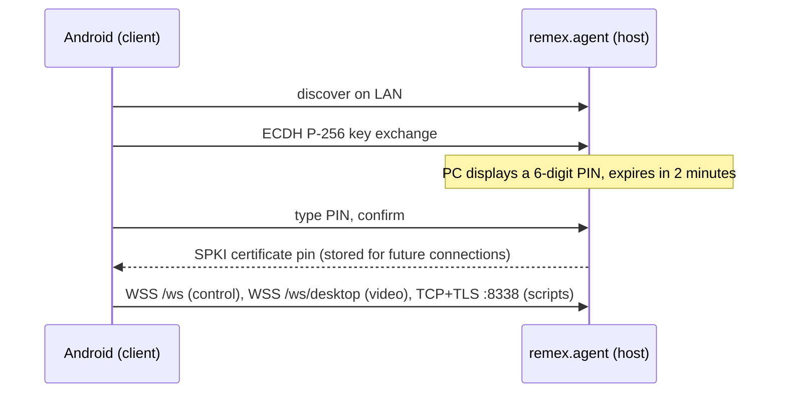
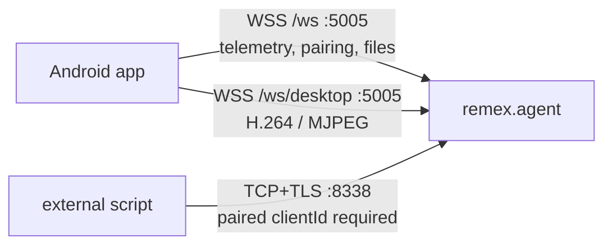

<div align="center">



<br />

[](https://play.google.com/store/apps/details?id=com.clindsay94.remex)
[](https://github.com/clindsay94/RemEx/releases/latest)

[](https://github.com/clindsay94/RemEx/releases)
[](https://github.com/clindsay94/RemEx/actions/workflows/dotnet.yml)
[](https://github.com/clindsay94/RemEx/releases)
[](docs/INSTALL-ANDROID.md)
[](#everything-it-does)
[](LICENSE)

**[Get started](#get-started-in-five-minutes)** &nbsp;·&nbsp; **[What's new in 3.0](#whats-new-in-30)** &nbsp;·&nbsp; **[How it works](#how-it-talks-to-your-pc)** &nbsp;·&nbsp; **[Build it](#building-from-source)** &nbsp;·&nbsp; **[Docs](#docs-index)**

</div>

<br />

RemEx runs your PC from your phone over plain LAN: no relay server, no account, no subscription. It's an Android app plus a Windows/Linux agent. Screen streaming, remote input, file transfer, clipboard sync, wake-on-LAN, power control, live sensors and routines, with just the two devices talking directly to each other.

> **3.0 is the biggest release yet.** 296 commits and 1,436 files changed since 2.5.0, a new look shared across both apps, routines that act on their own, and a startup splash that actually shows RemEx finding your PC. It's also the first release in production on Google Play.

## What's new in 3.0

<table>
<tr>
<td width="33%" valign="top">

### ⚡ Routines
Your phone acts on its own. Start a routine when you **get home** (spotted from your Wi-Fi, so no location permission), **tap an NFC tag**, or when a **PC sensor passes a limit**. Put one on the home screen as a shortcut or a widget that shows its last result.

</td>
<td width="33%" valign="top">

### 🖥️ Routines on the PC
The PC can run a routine itself when it goes idle, or locks or unlocks, even with your phone away. It keeps a history, lets you pause everything or block a phone, and shut down, restart and sleep always show a countdown first.

</td>
<td width="33%" valign="top">

### 🎨 One look, two apps
A fresh install of either app starts on the same RemEx colours. Cards, page titles, fonts and page names (Sensors, Commands, Apps, Processes, Files) now match on the PC and the phone.

</td>
</tr>
<tr>
<td valign="top">

### 🚀 A new startup splash
**Live Handshake** is the new default: it plays RemEx actually starting and finding your PC. Three more scenes are one tap away. [See them below.](#the-splash)

</td>
<td valign="top">

### 📱 A new phone layout
Five tabs: **Home, Desktop, Apps, Control, More**. Sensors is a grid you can edit by holding a card: move, resize, remove, add, or pin to Home. Pick 2, 3 or 4 columns, or let Auto decide.

</td>
<td valign="top">

### 🔔 Alerts and logs
The sensor alert rules you set on the PC arrive as notifications on your phone. Critical alerts pop up, warnings arrive quietly. The PC's logs and health checks are a page away in More, with anything private hidden before it's sent.

</td>
</tr>
<tr>
<td valign="top">

### 🗂️ Browse your phone from the PC
The Files page has a Source picker: **This PC** or any connected phone. Browse the folders the phone shares, search them, see thumbnails, download. With one off-by-default switch on the phone, change files there too.

</td>
<td valign="top">

### ✨ Make it yours
App backgrounds (six textures and three slow animated styles), six more card shapes and seven Nerd Fonts bundled in the app. Screens slide in, readings roll when they change, and switches give a short haptic buzz. Everything respects Remove animations.

</td>
<td valign="top">

### 🔒 Tighter by default
Apps and links RemEx opens on your PC run with your normal permissions, not administrator. The phone only opens folders you share, and checks your current Access settings on every request.

</td>
</tr>
</table>

The full 3.0 write-up is in the [release notes](docs/RELEASE-NOTES-3.0.0.md), and every change is in the [changelog](docs/CHANGELOG.md).

### The splash

Every launch opens on one of four scenes. Pick yours in Personalize.

| Scene | What you see |
|---|---|
| **Live Handshake** *(default)* | RemEx starting up and finding your PC, beat by beat. |
| **Original Scan** | A command deck: perspective grid floor, falling data columns and scanlines, with shockwave sweeps on every beat. |
| **Cosmic Zoom** | Flying through a nebula, three star layers stretching into warp streaks as the mark assembles. |
| **Pong** | A phosphor CRT court with glowing rails, heating up through the rally until the mark lands. |

All four share one shader on Android and the PC, and Original Scan, Cosmic Zoom and Pong settle on a still frame when Reduced motion is on.

## Get started in five minutes

| | Step |
|---|---|
| **1** | **Install the Android app** from [**Google Play**](https://play.google.com/store/apps/details?id=com.clindsay94.remex) (package `com.clindsay94.remex`). Prefer to sideload? The APK is on [GitHub Releases](https://github.com/clindsay94/RemEx/releases/latest), see [sideloading on Samsung](#sideloading-on-android-samsung-notes). |
| **2** | **Install the PC agent** from [GitHub Releases](https://github.com/clindsay94/RemEx/releases/latest) (table below). |
| **3** | **Pair.** Open the agent on the PC and RemEx on the phone, on the same Wi-Fi. The PC shows a 6-digit PIN (it expires in 2 minutes), you type it into the phone, done. While no phone is connected, **Pair a phone** on the PC's Home screen opens Settings with the QR code and PIN ready. Full walkthrough in [docs/INSTALL-ANDROID.md](docs/INSTALL-ANDROID.md#first-pairing). |

| Platform | Download | Size |
|---|---|---|
| **Windows** | `RemEx-v3.0.0-Setup.exe` (Inno Setup, installs to run elevated for input and power control) | 55.6 MB |
| **Android** | `RemEx-V3.0.0-release.apk` (sideload) | 38.2 MB |
| **Linux x64** | `remex-agent-v3.0.0-linux-x64.tar.gz`, see [Linux install](docs/LINUX_INSTALL.md) | 69.7 MB |

**Requires:** Android 14 or newer on the phone, a Windows or Linux PC, and both on the same network. To reach your PC from elsewhere, run [Tailscale](https://tailscale.com) on both ends, because RemEx has no relay of its own.


```mermaid
sequenceDiagram
    participant Phone as Android (client)
    participant PC as remex.agent (host)
    Phone->>PC: discover on LAN
    Phone->>PC: ECDH P-256 key exchange
    Note over PC: PC displays a 6-digit PIN, expires in 2 minutes
    Phone->>PC: type PIN, confirm
    PC-->>Phone: SPKI certificate pin (stored for future connections)
    Phone->>PC: WSS /ws (control), WSS /ws/desktop (video), TCP+TLS :8338 (scripts)
```

### Upgrading from 2.5

Install the new PC app over the old one. Your settings, paired phones and layout stay, and nothing about pairing or certificates changed, so you don't pair again. Update the PC and the phone together: a PC older than 3.0 still works with the 3.0 phone app, just without sensor alerts, the logs page, shared pinned sensors and PC-run routines.

## Everything it does

<details>
<summary>The full feature list</summary>

- Remote desktop screen streaming (H.264, on-demand keyframes, configurable and rate-limited fps), with remote input including stylus and two-finger scroll
- Routines: arrive or leave home, NFC tap, or PC sensor thresholds, run on the phone or on the PC itself
- Live sensors as an editable grid, pinned sensors shared between phone and PC, and alert rules that notify your phone
- File transfer both ways: whole folders, name-collision handling (Replace, Keep both, Skip, apply to all), speed and ETA, and browsing and optionally changing your phone's shared folders from the PC
- App launcher (allowlisted, no arbitrary or network paths) and a Processes page
- Power controls with a countdown, Wake-on-LAN without typing a MAC address
- Clipboard sync, phone to PC
- Multi-monitor support, including monitors placed above or left of the origin
- The PC's logs and diagnostics, readable from the phone
- Personalize: seed-based colour palettes with a colour wheel and live preview, Material You dynamic colour, backgrounds, card shapes, Nerd Fonts, four splash scenes, motion and haptics
- Paired-device management: rename or unpair from Settings, tap to connect from the phone
- First-run tutorial on both apps and a Home-screen readiness check (admin rights, certificate, firewall, start at sign-in)
- Localized in 9 languages: en, es, fr, hi, id, pl, pt-BR, tr, uk

</details>

## Sideloading on Android (Samsung notes)

If you install the APK from [GitHub Releases](https://github.com/clindsay94/RemEx/releases) instead of Google Play:

- Android will prompt once to allow installs from the source you opened the file with ("unknown sources"), as it does for any APK not installed through Play.
- Samsung phones also ship **Auto Blocker**, which can block sideloaded installs by default. If the install is silently refused, check Settings → Security and privacy → Auto Blocker and allow the install (or turn it off for the install).
- Sideloaded builds don't update themselves. Come back to Releases for the next version, or switch to Play.

See [docs/INSTALL-ANDROID.md](docs/INSTALL-ANDROID.md) for the full walkthrough.

## How it talks to your PC


```mermaid
flowchart LR
    A[Android app] -- "WSS /ws :5005<br/>telemetry, pairing, files" --> P[remex.agent]
    A -- "WSS /ws/desktop :5005<br/>H.264 / MJPEG" --> P
    S[external script] -- "TCP+TLS :8338<br/>paired clientId required" --> P
```

| Channel | Port | Carries |
|---|---|---|
| `WSS /ws` | 5005 | telemetry, power control, pairing, file transfer |
| `WSS /ws/desktop` | 5005 | remote desktop video (H.264/MJPEG) |
| `TCP+TLS` | 8338 | external script ingress, requires a paired client ID |

Pairing is ECDH P-256 key exchange plus a 6-digit PIN shown on the PC and typed on the phone, then SPKI certificate pinning for every connection after that, over TLS 1.3 (1.2 accepted). There's no cloud relay, no account, and no telemetry leaves your network. See [docs/SECURITY_EXPLAINED.md](docs/SECURITY_EXPLAINED.md) for how it works and [docs/SECURITY.md](docs/SECURITY.md) for the reporting policy.

## Building from source

```powershell
git clone https://github.com/clindsay94/RemEx.git
cd RemEx
./build-remex.ps1 -Target all -Config release   # PC + Android, one command
./scripts/verify.ps1                             # clean build + .NET test suite, writes a receipt
./scripts/verify.ps1 -Scope all                  # plus Android release tests and lintRelease
./scripts/verify.ps1 -Check                      # does the last receipt still match the code on disk?
```

<details>
<summary>Toolchain versions and project layout</summary>

- .NET SDK 10.0.x, Avalonia 12.1.1 (`remex.desktop`)
- Kotlin 2.3.21, AGP 9.2.1, Gradle 9.4.1, JDK 17, Compose UI 1.12.0-beta02 with Material3 1.5.0-alpha24 (`remex.android`)
- `remex.core`, shared protocol/models (`RemexMessage`, `DesktopMeta`, `TelemetryPayload`), targets `net10.0` and `net10.0-android`
- `remex.agent` / `remex.agent.windows` / `remex.agent.native.linux`, the PC host and its platform backends
- `remex.desktop`, Avalonia UI (Personalize, dashboard, tray)
- `remex.android`, the Kotlin/Compose client
- `remex.branding`, shared branding assets and the splash scenes
- `installer/`, Inno Setup (`RemEx.iss`) for Windows, packaging scripts for Linux
- `*.tests` projects per component, plus `remex.desktop.render.tests` for UI screenshot/automation checks

Full build docs: [docs/BUILDING.md](docs/BUILDING.md). CI runs on GitHub Actions: `.github/workflows/dotnet.yml` builds and tests Windows + Linux on every PR to main, and `.github/workflows/localization-check.yml` checks all 9 languages for missing, stale, unused, or format-mismatched keys.

</details>

## Contributing

See [docs/CONTRIBUTING.md](docs/CONTRIBUTING.md) and [docs/CODE_OF_CONDUCT.md](docs/CODE_OF_CONDUCT.md). This repo is developed with Claude Code; [.claude/CLAUDE.md](.claude/CLAUDE.md) has the project rules (architecture invariants, the verification gate, coding conventions) if you're pairing an agent with it.

> [!WARNING]
> Read [docs/REGRESSION-GUARDS.md](docs/REGRESSION-GUARDS.md) before touching capture, the remote-desktop stream/pacing, the Android H.264 decoder, SurfaceView zoom/pan, pairing/trust, or the session guard. Every rule in there exists because breaking it reintroduced a real failure that showed up as silence, a black screen, a dead stream, a bricked pairing, with no log line pointing back at the cause.

## Reporting a security issue

Please don't open a public issue for a vulnerability. See [docs/SECURITY.md](docs/SECURITY.md) for how to report privately.

## Docs index

| Doc | What's in it |
|---|---|
| [docs/RELEASE-NOTES-3.0.0.md](docs/RELEASE-NOTES-3.0.0.md) | Readable summary of everything in 3.0 |
| [docs/CHANGELOG.md](docs/CHANGELOG.md) | Full changelog, all versions |
| [docs/INSTALL-ANDROID.md](docs/INSTALL-ANDROID.md) | Google Play, sideloading, Auto Blocker, first pairing |
| [docs/ANDROID_SETUP.md](docs/ANDROID_SETUP.md) | Android dev environment / SDK setup |
| [docs/LINUX_INSTALL.md](docs/LINUX_INSTALL.md) | Linux agent install and dependencies |
| [docs/BUILDING.md](docs/BUILDING.md) | Full build instructions, all platforms |
| [docs/ARCHITECTURE-HOST.md](docs/ARCHITECTURE-HOST.md) | PC agent architecture |
| [docs/API_CONTRACTS.md](docs/API_CONTRACTS.md) | Message/protocol contracts between client and host |
| [docs/FILE_SHARING.md](docs/FILE_SHARING.md) | File transfer design |
| [docs/SECURITY.md](docs/SECURITY.md) | Vulnerability reporting policy |
| [docs/SECURITY_EXPLAINED.md](docs/SECURITY_EXPLAINED.md) | How pairing, pinning, and the channels work |
| [docs/CONTRIBUTING.md](docs/CONTRIBUTING.md) | How to contribute |
| [docs/CODE_OF_CONDUCT.md](docs/CODE_OF_CONDUCT.md) | Code of conduct |
| [docs/REGRESSION-GUARDS.md](docs/REGRESSION-GUARDS.md) | Guards against known silent-failure regressions |
| [docs/FAQ-PARITY.md](docs/FAQ-PARITY.md) | Developer doc: the 16 FAQ questions both apps must answer, and the parity rule |
| [docs/ASYNC_GUIDELINES.md](docs/ASYNC_GUIDELINES.md) | Async coding conventions |
| [docs/NULL_SAFETY_GUIDELINES.md](docs/NULL_SAFETY_GUIDELINES.md) | Null-safety conventions |
| [docs/VALIDATION_GUIDELINES.md](docs/VALIDATION_GUIDELINES.md) | Input validation conventions |
| [.claude/CLAUDE.md](.claude/CLAUDE.md) | Project rules for coding agents |

## License

MIT. See [LICENSE](LICENSE).
